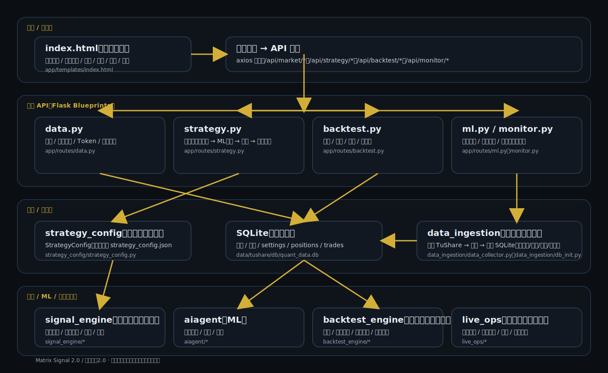

# 矩测系统2.0（Matrix Signal 2.0）架构图与文件说明

本文件分为两部分：
1. 端到端量化过程架构图（图片）
2. 项目内“每个文件夹/文件”的用途说明（按目录展开）

---

## 1) 端到端量化过程链路图（图片）

---

## 2) 文件夹与文件用途说明（按目录展开）

说明：
- `__pycache__/`、`*.pyc` 属于 Python 缓存文件，不影响业务逻辑；如需清理可删除。
- `data/`、`logs/` 多为运行时产物（数据库、模型、状态、日志），会随运行增长。

模块语义化命名（已从 moduleX 目录重命名为更可读的目录名）：
- module1 → strategy_config：策略配置中心（StrategyConfig / strategy_config.json）
- module2 → data_ingestion：数据采集入库（TuShare 拉取、清洗、写入 SQLite）
- module3 → signal_engine：因子与信号引擎（因子评分、阈值决策、过滤、触发检查）
- module5 → backtest_engine：回测与优化引擎（撮合、绩效指标、参数优化、风险/过拟合评估）
- module6 → live_ops：实盘监控与运维（监控循环、异常检测、日志、紧急处理）

### 2.1 根目录（quant/）

- [.env](file:///D:/web%20development/quant/.env)：本地环境变量（通常含敏感信息，不建议提交）。
- [.env.example](file:///D:/web%20development/quant/.env.example)：环境变量示例模板。
- [.gitignore](file:///D:/web%20development/quant/.gitignore)：Git 忽略规则。
- [requirements.txt](file:///D:/web%20development/quant/requirements.txt)：Python 依赖清单。
- [run.py](file:///D:/web%20development/quant/run.py)：Flask 启动入口（创建 app 并运行服务）。
- [config.py](file:///D:/web%20development/quant/config.py)：全局配置（DB 路径、日志路径等）。
- [strategy_config.json](file:///D:/web%20development/quant/strategy_config.json)：策略/风控/模型路径等配置持久化（StrategyConfig 读写）。
- [test_friction.py](file:///D:/web%20development/quant/test_friction.py)：实验/验证脚本（用于快速测试某些逻辑）。
- [README.md](file:///D:/web%20development/quant/README.md)：项目说明入口文档。
- [TECHNICAL_DOCUMENTATION.md](file:///D:/web%20development/quant/TECHNICAL_DOCUMENTATION.md)：项目技术文档（开发记录、模块说明等）。
- [OPTIMIZATION_DOCUMENTATION.md](file:///D:/web%20development/quant/OPTIMIZATION_DOCUMENTATION.md)：参数优化/调优相关文档。
- [BATCH_INGEST_DOCUMENTATION.md](file:///D:/web%20development/quant/BATCH_INGEST_DOCUMENTATION.md)：批量拉取/入库相关说明。
- [ARCHITECTURE_OPTIMIZATION_20260329.md](file:///D:/web%20development/quant/ARCHITECTURE_OPTIMIZATION_20260329.md)：架构与优化记录（历史文档）。
- [A_SHARE_DAILY_ML_UPGRADE_20260330.md](file:///D:/web%20development/quant/A_SHARE_DAILY_ML_UPGRADE_20260330.md)：A股 ML 升级日更记录（历史文档）。
- [ARCHITECTURE_CHAIN_DIAGRAM.svg](file:///D:/web%20development/quant/ARCHITECTURE_CHAIN_DIAGRAM.svg)：端到端链路图（本文件引用）。
- [TECHNICAL_ARCHITECTURE_FILE_GUIDE.md](file:///D:/web%20development/quant/TECHNICAL_ARCHITECTURE_FILE_GUIDE.md)：本说明文件。

### 2.2 .streamlit/

- [.streamlit/secrets.toml](file:///D:/web%20development/quant/.streamlit/secrets.toml)：Streamlit 相关 secrets 配置（如使用 Streamlit 展示/实验时）。

### 2.3 app/（Flask Web 服务层）

- [app/__init__.py](file:///D:/web%20development/quant/app/__init__.py)：Flask app factory，初始化配置/扩展并注册各蓝图（routes）。
- [app/db.py](file:///D:/web%20development/quant/app/db.py)：SQLite 连接管理（Flask 上下文）与 settings 读取工具。
- [app/schema.sql](file:///D:/web%20development/quant/app/schema.sql)：数据库初始化 SQL（用于创建基础表结构）。
- [app/utils.py](file:///D:/web%20development/quant/app/utils.py)：通用工具（如日志初始化）。

#### app/templates/

- [app/templates/index.html](file:///D:/web%20development/quant/app/templates/index.html)：单页前端（Vue + Bootstrap），包含所有模块页面与交互逻辑（菜单、设置、语言、图表、表格等）。

#### app/routes/（API 蓝图）

- [app/routes/main.py](file:///D:/web%20development/quant/app/routes/main.py)：页面入口路由（如 `/` 渲染模板）。
- [app/routes/data.py](file:///D:/web%20development/quant/app/routes/data.py)：数据/指数/标的搜索/Token 等接口；负责访问 TuShare 并做缓存。
- [app/routes/strategy.py](file:///D:/web%20development/quant/app/routes/strategy.py)：策略配置接口 + 信号分析链路（因子、ML 概率、仓位、建议下单）。
- [app/routes/backtest.py](file:///D:/web%20development/quant/app/routes/backtest.py)：回测/优化/风险测试/过拟合检查接口；封装调用 backtest_engine（回测与优化引擎）。
- [app/routes/ml.py](file:///D:/web%20development/quant/app/routes/ml.py)：模型训练状态、训练启动/取消、模型导入导出接口；封装调用 aiagent。
- [app/routes/monitor.py](file:///D:/web%20development/quant/app/routes/monitor.py)：实时监控状态、绩效、异常、日志、紧急处理等接口；封装调用 live_ops（实盘监控与运维）。
- [app/routes/trading.py](file:///D:/web%20development/quant/app/routes/trading.py)：持仓/交易记录/资金/策略运行状态台账接口（读写 SQLite）。

### 2.4 aiagent/（机器学习子系统）

- [aiagent/__init__.py](file:///D:/web%20development/quant/aiagent/__init__.py)：模块说明与导出。
- [aiagent/config.py](file:///D:/web%20development/quant/aiagent/config.py)：ML 训练与模型相关配置（超参默认值等）。
- [aiagent/feature_spec.py](file:///D:/web%20development/quant/aiagent/feature_spec.py)：读取 `data/tushare/raw/feature_list.json`（特征清单与 label 配置）。
- [aiagent/ml_features.py](file:///D:/web%20development/quant/aiagent/ml_features.py)：特征工程（从 OHLCV/估值/资金流构造特征列，如 RSI/MACD/ATR/均线/乖离/波动率等）。
- [aiagent/ml_pipeline.py](file:///D:/web%20development/quant/aiagent/ml_pipeline.py)：训练主流程（批量取数→特征→标签→滚动训练→保存模型 bundle）。
- [aiagent/model_manager.py](file:///D:/web%20development/quant/aiagent/model_manager.py)：模型版本管理与落盘（metadata/stats/weights 等组织为 bundle）。
- [aiagent/model_runtime.py](file:///D:/web%20development/quant/aiagent/model_runtime.py)：运行时加载模型 bundle，并提供推理所需的对象与元信息。
- [aiagent/model_trainer.py](file:///D:/web%20development/quant/aiagent/model_trainer.py)：训练器封装（如训练过程分层组织/复用）。
- [aiagent/prediction_service.py](file:///D:/web%20development/quant/aiagent/prediction_service.py)：推理服务封装（给策略/回测调用）。
- [aiagent/data_preparation.py](file:///D:/web%20development/quant/aiagent/data_preparation.py)：训练数据准备/清洗辅助逻辑。
- [aiagent/example.py](file:///D:/web%20development/quant/aiagent/example.py)：示例/演示脚本（说明如何调用训练/推理组件）。

### 2.5 strategy_config/（策略配置中心）

- [strategy_config/__init__.py](file:///D:/web%20development/quant/strategy_config/__init__.py)：模块导出入口。
- [strategy_config/strategy_config.py](file:///D:/web%20development/quant/strategy_config/strategy_config.py)：StrategyConfig：默认配置、校验、更新、写回 `strategy_config.json`，并维护 ML 模型状态字段。

### 2.6 data_ingestion/（数据采集入库）

- [data_ingestion/__init__.py](file:///D:/web%20development/quant/data_ingestion/__init__.py)：模块导出入口。
- [data_ingestion/data_collector.py](file:///D:/web%20development/quant/data_ingestion/data_collector.py)：RealTimeDataCollector：通过 TuShare 拉历史/实时数据，清洗并 upsert 入 SQLite。
- [data_ingestion/db_init.py](file:///D:/web%20development/quant/data_ingestion/db_init.py)：数据库初始化与迁移；监控标的（monitored_symbols）增删查。

### 2.7 signal_engine/（因子与信号引擎）

- [signal_engine/__init__.py](file:///D:/web%20development/quant/signal_engine/__init__.py)：模块导出入口。
- [signal_engine/factor_calculator.py](file:///D:/web%20development/quant/signal_engine/factor_calculator.py)：因子计算与评分（估值/趋势/资金），输出综合总分等。
- [signal_engine/signal_generator.py](file:///D:/web%20development/quant/signal_engine/signal_generator.py)：基于因子得分与阈值生成 buy/sell/hold 信号与置信度。
- [signal_engine/signal_filter.py](file:///D:/web%20development/quant/signal_engine/signal_filter.py)：信号过滤（黑名单、流动性、波动等规则过滤）。
- [signal_engine/trade_trigger.py](file:///D:/web%20development/quant/signal_engine/trade_trigger.py)：交易触发/执行检查（止损止盈、仓位限制等触发逻辑）。

### 2.8 backtest_engine/（回测与优化引擎）

- [backtest_engine/__init__.py](file:///D:/web%20development/quant/backtest_engine/__init__.py)：模块导出入口。
- [backtest_engine/backtest_engine.py](file:///D:/web%20development/quant/backtest_engine/backtest_engine.py)：回测引擎（逐 bar 撮合、费用模型、绩效指标、约束执行）。
- [backtest_engine/parameter_optimizer.py](file:///D:/web%20development/quant/backtest_engine/parameter_optimizer.py)：参数优化器（网格/序贯优化；含 ML 批量推理加速路径）。
- [backtest_engine/risk_tester.py](file:///D:/web%20development/quant/backtest_engine/risk_tester.py)：风险测试（不同风险场景/压力测试）。
- [backtest_engine/overfitting_checker.py](file:///D:/web%20development/quant/backtest_engine/overfitting_checker.py)：过拟合检查（分段/扰动/对照等检查）。

### 2.9 live_ops/（实盘监控与运维）

- [live_ops/__init__.py](file:///D:/web%20development/quant/live_ops/__init__.py)：模块导出入口。
- [live_ops/realtime_monitor.py](file:///D:/web%20development/quant/live_ops/realtime_monitor.py)：RealtimeMonitor：周期轮询监控、绩效采集、异常检测、日志聚合。
- [live_ops/trade_logger.py](file:///D:/web%20development/quant/live_ops/trade_logger.py)：交易日志写入与查询辅助。
- [live_ops/emergency_handler.py](file:///D:/web%20development/quant/live_ops/emergency_handler.py)：紧急处理（停机/清仓/风险检查等）。
- [live_ops/iteration_optimizer.py](file:///D:/web%20development/quant/live_ops/iteration_optimizer.py)：迭代优化器（运维/策略迭代辅助逻辑）。

### 2.10 scripts/（批处理与运维脚本）

- [scripts/.fetch_state.txt](file:///D:/web%20development/quant/scripts/.fetch_state.txt)：批处理拉数的进度/状态记录文件。
- [scripts/check_coverage.py](file:///D:/web%20development/quant/scripts/check_coverage.py)：覆盖率检查（数据库中行情覆盖范围/缺口统计）。
- [scripts/check_divs.py](file:///D:/web%20development/quant/scripts/check_divs.py)：分红/复权相关检查脚本。
- [scripts/trace_divs.py](file:///D:/web%20development/quant/scripts/trace_divs.py)：分红/复权链路追踪脚本。
- [scripts/fetch_history_batch.py](file:///D:/web%20development/quant/scripts/fetch_history_batch.py)：批量拉取历史行情并入库。
- [scripts/inspect_qfq_backfill_gaps.py](file:///D:/web%20development/quant/scripts/inspect_qfq_backfill_gaps.py)：检查/生成复权回补缺口报告。
- [scripts/show_qfq_backfill_progress.py](file:///D:/web%20development/quant/scripts/show_qfq_backfill_progress.py)：显示复权回补进度。
- [scripts/train_ml_model.py](file:///D:/web%20development/quant/scripts/train_ml_model.py)：命令行训练入口（调用 aiagent 训练流程）。
- [scripts/update_db.py](file:///D:/web%20development/quant/scripts/update_db.py)：数据库维护/迁移脚本。
- [scripts/run_batches.ps1](file:///D:/web%20development/quant/scripts/run_batches.ps1)：Windows PowerShell 批处理运行脚本。

### 2.11 tests/（测试）

- [tests/test_module2.py](file:///D:/web%20development/quant/tests/test_module2.py)：data_ingestion（数据采集/入库）相关测试。
- [tests/test_module5.py](file:///D:/web%20development/quant/tests/test_module5.py)：backtest_engine（回测引擎/指标）相关测试。

### 2.12 data/（运行时数据/模型/状态）

说明：该目录为运行产物，体量可能较大。这里按“用途”列出关键文件与结构。

#### data/tushare/db/

- [data/tushare/db/.gitkeep](file:///D:/web%20development/quant/data/tushare/db/.gitkeep)：占位文件（保证目录存在）。
- [data/tushare/db/quant_data.db](file:///D:/web%20development/quant/data/tushare/db/quant_data.db)：SQLite 主库（行情、台账、settings、训练状态等）。

#### data/tushare/raw/

- [data/tushare/raw/.gitkeep](file:///D:/web%20development/quant/data/tushare/raw/.gitkeep)：占位文件。
- [data/tushare/raw/feature_list.json](file:///D:/web%20development/quant/data/tushare/raw/feature_list.json)：ML 特征清单与标签配置（训练与推理共同依赖）。

#### data/tushare/models/

- [data/tushare/models/model_registry.json](file:///D:/web%20development/quant/data/tushare/models/model_registry.json)：模型注册表（记录可用模型与版本信息）。
- [data/tushare/models/logs/model_management.log](file:///D:/web%20development/quant/data/tushare/models/logs/model_management.log)：模型管理日志。

##### data/tushare/models/ml_model/（训练输出目录）

- [data/tushare/models/ml_model/202603300804/environment.json](file:///D:/web%20development/quant/data/tushare/models/ml_model/202603300804/environment.json)：训练环境信息。
- [data/tushare/models/ml_model/202603300804/feature_config.json](file:///D:/web%20development/quant/data/tushare/models/ml_model/202603300804/feature_config.json)：特征配置快照（features/label 等）。
- [data/tushare/models/ml_model/202603300804/feature_stats.json](file:///D:/web%20development/quant/data/tushare/models/ml_model/202603300804/feature_stats.json)：特征标准化统计（mean/std）。
- [data/tushare/models/ml_model/202603300804/metadata.json](file:///D:/web%20development/quant/data/tushare/models/ml_model/202603300804/metadata.json)：训练元数据（窗口、指标、参数等）。
- [data/tushare/models/ml_model/202603300804/model_card.json](file:///D:/web%20development/quant/data/tushare/models/ml_model/202603300804/model_card.json)：模型说明卡片。
- [data/tushare/models/ml_model/202603300804/model_weights.pkl](file:///D:/web%20development/quant/data/tushare/models/ml_model/202603300804/model_weights.pkl)：模型权重（XGBoost bundle）。
- [data/tushare/models/ml_model/202603301823/*](file:///D:/web%20development/quant/data/tushare/models/ml_model/202603301823)：同上，一次训练版本目录。
- [data/tushare/models/ml_model/202603301925/*](file:///D:/web%20development/quant/data/tushare/models/ml_model/202603301925)：同上，一次训练版本目录（当前启用常见来源）。

##### data/tushare/models/imported/（导入模型目录）

- [data/tushare/models/imported/20260329191826/model_weights.pkl](file:///D:/web%20development/quant/data/tushare/models/imported/20260329191826/model_weights.pkl)：导入模型权重文件。
- [data/tushare/models/imported/20260329192226/202603291126/*](file:///D:/web%20development/quant/data/tushare/models/imported/20260329192226/202603291126)：导入模型的版本化目录结构（含 metadata/stats/weights）。
- [data/tushare/models/imported/20260329225518/202603291126/*](file:///D:/web%20development/quant/data/tushare/models/imported/20260329225518/202603291126)：导入模型的版本化目录结构（含 metadata/stats/weights）。

#### data/tushare/reports/

- [data/tushare/reports/.gitkeep](file:///D:/web%20development/quant/data/tushare/reports/.gitkeep)：占位文件。
- [data/tushare/reports/coverage_db_20220101_20260326.csv](file:///D:/web%20development/quant/data/tushare/reports/coverage_db_20220101_20260326.csv)：数据库覆盖率报告（CSV）。
- [data/tushare/reports/coverage_db_20220101_20260326.md](file:///D:/web%20development/quant/data/tushare/reports/coverage_db_20220101_20260326.md)：数据库覆盖率报告（MD）。

#### data/tushare/state/

- [data/tushare/state/.gitkeep](file:///D:/web%20development/quant/data/tushare/state/.gitkeep)：占位文件。
- [data/tushare/state/ml_train_status.json](file:///D:/web%20development/quant/data/tushare/state/ml_train_status.json)：训练状态文件（前端轮询展示）。
- [data/tushare/state/ml_train_status.json.cancel](file:///D:/web%20development/quant/data/tushare/state/ml_train_status.json.cancel)：训练取消标记文件。
- [data/tushare/state/fetch_state_qfq_all.txt](file:///D:/web%20development/quant/data/tushare/state/fetch_state_qfq_all.txt)：批量拉数进度（复权相关）。
- [data/tushare/state/fetch_state_qfq_all_v2.txt](file:///D:/web%20development/quant/data/tushare/state/fetch_state_qfq_all_v2.txt)：批量拉数进度（v2）。
- [data/tushare/state/fetch_state_qfq_smoke*.txt](file:///D:/web%20development/quant/data/tushare/state)：批量拉数 smoke 测试进度文件（多版本）。
- [data/tushare/state/fetch_history_qfq_smoke*.md](file:///D:/web%20development/quant/data/tushare/state)：批量拉数 smoke 测试报告（多版本）。
- [data/tushare/state/inspect_qfq_backfill_gaps.txt](file:///D:/web%20development/quant/data/tushare/state/inspect_qfq_backfill_gaps.txt)：复权缺口检查输入/记录文件。
- [data/tushare/state/inspect_qfq_backfill_gaps_report.txt](file:///D:/web%20development/quant/data/tushare/state/inspect_qfq_backfill_gaps_report.txt)：复权缺口检查报告。

##### data/tushare/state/downloads/

- [data/tushare/state/downloads/model_20260329225456.zip](file:///D:/web%20development/quant/data/tushare/state/downloads/model_20260329225456.zip)：模型下载缓存（zip）。
- [data/tushare/state/downloads/model_20260330150159.zip](file:///D:/web%20development/quant/data/tushare/state/downloads/model_20260330150159.zip)：模型下载缓存（zip）。
- [data/tushare/state/downloads/model_20260330150201.zip](file:///D:/web%20development/quant/data/tushare/state/downloads/model_20260330150201.zip)：模型下载缓存（zip）。
- [data/tushare/state/downloads/model_20260330150202.zip](file:///D:/web%20development/quant/data/tushare/state/downloads/model_20260330150202.zip)：模型下载缓存（zip）。
- [data/tushare/state/downloads/model_20260330182354.zip](file:///D:/web%20development/quant/data/tushare/state/downloads/model_20260330182354.zip)：模型下载缓存（zip）。

### 2.13 logs/（运行日志）

- [logs/app.log](file:///D:/web%20development/quant/logs/app.log)：Flask/应用运行日志（Web 层）。
- [logs/quant_system.log](file:///D:/web%20development/quant/logs/quant_system.log)：系统运行日志（策略/回测/监控等）。
